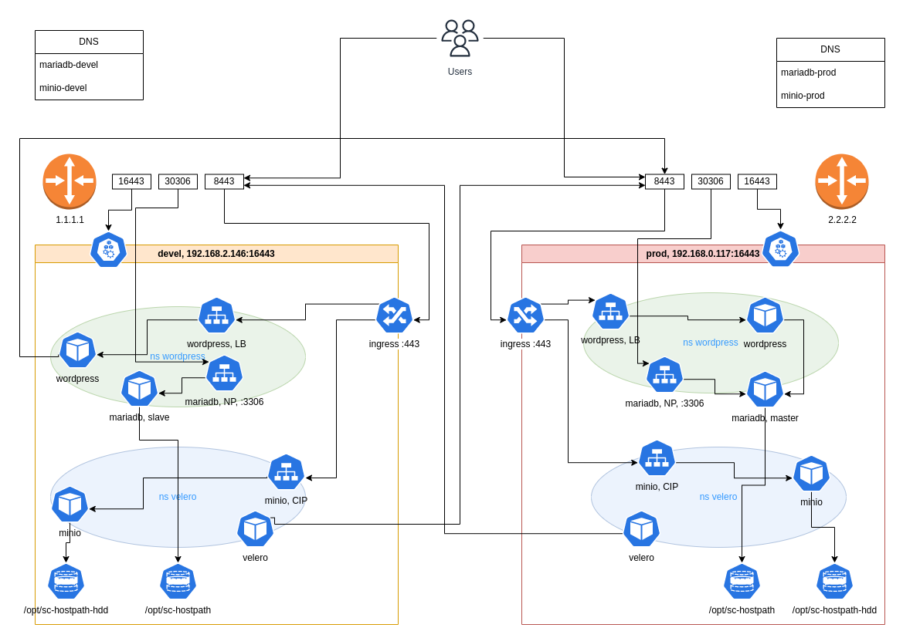

# AnsibleCD

This project illustrates the GitOps approach for managing kubernetes clusters using only Ansible *instead of FluxCD or ArgoCD*. A commit to the devel git branch automatically rolls out changes to the devel environment, a commit (merge from devel) to the prod branch makes changes to the prod environment. Commit to production can happen automatically after automatic testing of the devel environment. Minor differences in the application of roles to development clusters and production clusters are implemented using the appropriate conditions.

In this example, devel and prod environments are slightly different, which is of course undesirable for real work.

## Staging

### Linux/MacOS/Windows/AndroidTV/etc workstation and Github Actions

- Ansible and gh actions as GitOps continuous delivery tool for Kubernetes
- Need to have two kubernetes clusters microk8s/minikube/k3s or GKE/EKS/AKS
- Browser, github, vscode.dev only

Steps to reproduce:

- **fork** the project on github
- git clone repo
- cp ~/.kube/config.yml ./config.yaml
- echo "secret" > .vault_pass
- ansible-vault encrypt --vault-pass-file .vault_pass config.yaml (you will share this file with other collaborators)
- git add config.yaml
- edit github *secrets*, ANSIBLE_VAULT_PASSWORD=secret (this vault decryption secret is not available to non-collaborators)
- edit github *variables*, CONTEXT_DEVEL=devel, CONTEXT_PROD=prod (these variables will rewrite some of the variables in inventories)
- make any commit to main branch (prod context) or run gh action
- make commit to devel branch (devel context) branch from browser

### Linux workstation only

- Need to have two kubernetes clusters microk8s/minikube/k3s or GKE/EKS/AKS
- All team members (collaborators) must complete the clusters authentication setup
- Linux workstation with ansible/kubectl installed (apt/dnf install kubernetes-client ansible python3-kubernetes)

Steps to reproduce:

- **clone** github project
- echo 'my_vault_password' > .vault_pass
- echo '.vault_pass' >> .gitignore
- set auto git push on commit via git hooks
- edit inventories/all/vars/main.yalm (use: ansible-vault encrypt_string --vault-password-file .vault_pass 'my_secret' --name 'var_rnd_password')
- K8S_AUTH_CONTEXT=devel ansible-playbook --vault-pass-file .vault_pass devel.yaml (manually or git hooks)
- K8S_AUTH_CONTEXT=prod ansible-playbook --vault-pass-file .vault_pass prod.yaml (manually or git hooks)

## Attached example

The attached example deploys almost identical sets for running and backing up the WordPress system on two clusters. A commit to devel initiates changes on the devel cluster and automated tests. After that, the developer decides to merge into the master, which makes changes to the productive cluster with similar subsequent checks.

### Diagram

### Roles

- storage
- mariadb
- wordpress
- velero
- minio
- ingress
- test

### Automated test role

- get wordpress url
- check s3 (TODO)
- check backup (TODO)
